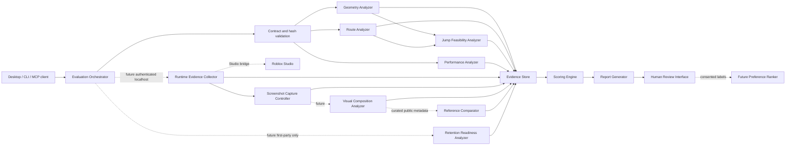
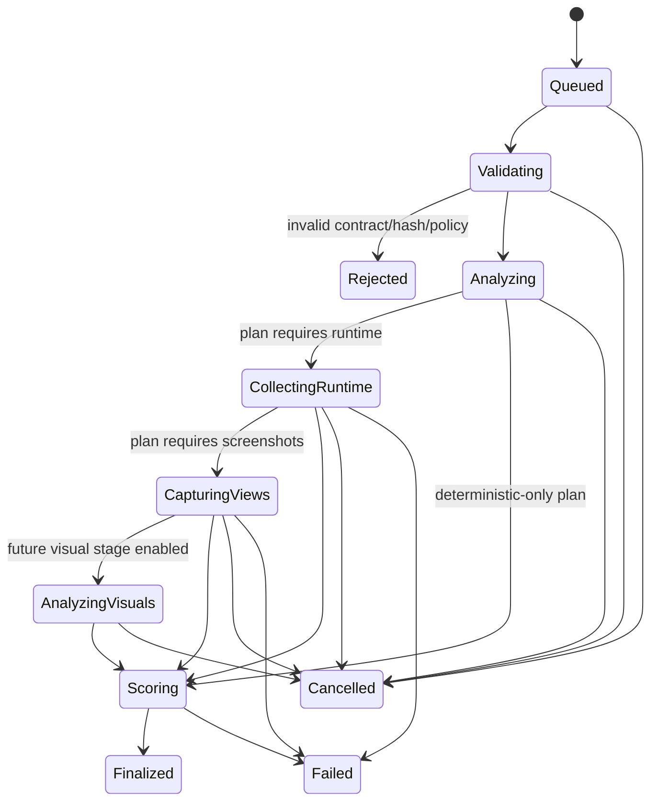

# Evaluator architecture and trust boundaries

## System context

The evaluator consumes a validated SceneManifest and an EvaluationPlan. It first produces
deterministic geometry and route evidence. Optional future stages collect Studio runtime evidence,
screenshots, visual signals, reference comparisons, human preference labels, and first-party
analytics calibration. The Scoring Engine combines only compatible, versioned evidence and emits an
immutable EvaluationReport.

Dashed components or connections are designed for later phases and are not implemented in E0.

## Components

### Evaluation Orchestrator

- Validates the request, EvaluationPlan, SceneManifest schema/version, manifest hash, evaluator
  compatibility, and resource limits.
- Creates a run ID, configuration hash, immutable input snapshot, cancellation token, and stage DAG.
- Schedules analyzers in deterministic order where results depend on one another and in bounded
  parallel where they do not.
- Enforces timeouts, evidence requirements, retries for idempotent collection only, and terminal run
  states.
- Never invents evidence or converts missing stages into passing metrics.

### Geometry Analyzer

- Converts native gameplay objects into canonical world-space primitives and surfaces.
- Calculates bounds, centers, top surfaces, separation, overlap, clearance, object density, and
  spatial indexes.
- Marks approximation sources such as rotated blocks and wedges.
- Rejects non-finite values, unsupported shapes, out-of-bounds geometry, and collision ownership
  violations.

### Route Analyzer

- Uses `SceneManifest.navigation.safeRouteObjectIds` as the declared route source of truth.
- Resolves route transitions by object ID, never construction order.
- Detects missing/duplicate targets, disconnected route segments, finish absence, checkpoint
  ordering errors, graph dead ends, candidate softlocks, and candidate unintended skips.
- Produces both the declared safe-route graph and a conservative spatial adjacency graph.

### Jump Feasibility Analyzer

- E1 uses deterministic coarse surface-to-surface limits compatible with Phase 0 assumptions.
- A later exact mode may run pinned avatar/controller simulations in Studio.
- Reports model name, rig, movement parameters, tolerances, start/landing regions, and uncertainty.
- Never labels a heuristic estimate as exact physics evidence.

### Runtime Evidence Collector

- Future authenticated bridge that loads an exact scene hash into Studio, starts bounded playtests,
  records observations, captures logs/performance, and stops the session.
- Tags every observation with scene hash, generation token, player/session ID, monotonic time, and
  collector version.
- Discards evidence from stale scenes or superseded generations.

### Screenshot Capture Controller

- Applies a versioned ScreenshotView protocol, fixed cameras, deterministic lighting/UI/character
  policy, viewport, quality, settle time, and capture time.
- Records both requested and observed camera/environment settings.
- Rejects captures whose scene hash or generation changes during capture.

### Visual Composition Analyzer

- Future worker that extracts palette, contrast, saliency, segmentation, clutter, hierarchy, style
  consistency, and image-quality signals.
- Emits feature evidence and calibrated estimates, not aesthetic truth.
- Cannot override gameplay or collision findings.

### Reference Comparator

- Compares compatible visual feature summaries against curated reference profiles.
- Uses provenance, permitted-use status, genre/style strata, screenshot type, and capture conditions.
- Reports similarity and distance as context; it never recommends copying a reference.

### Performance Analyzer

- E1 statically counts Parts, MeshParts if later permitted, materials, lights, emitters, scripts,
  collision/query/touch surfaces, and estimated triangles when metadata exists.
- Later runtime mode consumes frame, memory, physics, and network samples.
- Uses device-class profiles and reports uncertainty when only static estimates exist.

### Retention Readiness Analyzer

- Evaluates design prerequisites such as clear first objective, early interaction/reward timing,
  checkpoint pacing, difficulty smoothness, and mobile performance risk.
- Later calibration may use privacy-reviewed analytics from experiences owned by this project.
- Produces readiness estimates and correlations, never guaranteed retention or causal claims.

### Scoring Engine

- Resolves metric definitions by evaluator/profile version.
- Applies blocking failures, score caps, evidence completeness rules, confidence penalties, and
  category weights.
- Keeps raw facts, normalized metric scores, category scores, confidence, and caps separately.
- Refuses cross-run comparison when plans, evaluator versions, or required evidence are
  incompatible.

### Evidence Store

- Content-addressed, append-only store for canonical JSON records and binary artifacts.
- Separates an index/database from immutable blobs; checks hashes on write and read.
- Maintains provenance, retention class, access policy, and deletion tombstones where source
  deletion is required.
- Redacts tokens, usernames, chat, and unrelated player data before persistence.

### Report Generator

- Produces machine-readable JSON and a human-readable report from the same finalized run.
- Links every metric and finding to evidence IDs and identifies missing evidence.
- Includes evaluator/configuration versions, score caps, limitations, and reproducibility commands.

### Human Review Interface

- Future review surface for evidence inspection, finding disposition, pairwise comparisons, and
  approval/rejection of correction suggestions.
- Displays source type and uncertainty adjacent to every score.
- Requires explicit approval before any proposed correction is applied.

### Future Preference Ranker

- Future calibrated ranker trained only after dataset, consent, licensing, bias, and evaluation gates
  are approved.
- Consumes pairwise labels and feature summaries; it does not consume private competitor analytics.
- Remains advisory and cannot clear blocking deterministic failures.

## Evaluation state machine

`Finalized`, `Rejected`, `Cancelled`, and `Failed` are terminal. A retry creates a new run with
`supersedesRunId`; finalized evidence is never mutated.

## Trust boundaries

| Boundary                       | Untrusted input                      | Required controls                                                                                             | Output classification      |
| ------------------------------ | ------------------------------------ | ------------------------------------------------------------------------------------------------------------- | -------------------------- |
| Client → Orchestrator          | Requests, paths, plans, cancellation | Schema validation, workspace path allowlist, size/rate limits, authenticated local session                    | Validated job request      |
| SceneManifest → Analyzer       | Generated or edited JSON             | Draft 2020-12 validation, semantic validation, hash verification, supported versions, finite/bounded geometry | Deterministic evidence     |
| Orchestrator → Studio          | Scene payload, commands              | Loopback only, ephemeral mutual token, origin/session binding, sequence numbers, scene hash, generation token | Scoped command             |
| Studio → Collector             | Logs, screenshots, observations      | Run/session binding, schema validation, timestamp bounds, artifact hashing, stale-scene rejection, redaction  | Runtime evidence           |
| Visual worker → Store          | Model features/scores                | Pinned worker/model/config, input artifact hash, resource sandbox, output schema, confidence                  | Probabilistic evidence     |
| Reference dataset → Comparator | Public metadata/artifacts            | Provenance/license review, allowlist, deletion policy, duplicate checks, no executable content                | Contextual evidence        |
| Analytics → Calibrator         | First-party event aggregates         | Consent/legal review, minimization, cohort thresholds, experiment metadata, no raw identifiers                | Analytics-derived evidence |
| Human reviewer → Label store   | Labels/comments                      | Authenticated reviewer, instructions version, quality controls, moderation/redaction                          | Subjective evidence        |
| Suggestion → Scene mutation    | Proposed correction                  | Human approval, patch preview, current hash/generation check, validation, atomic rebuild, rollback            | New scene revision         |

## Failure and degradation rules

- Contract, manifest-hash, unsafe-object, or stale-generation failures stop before scene mutation.
- Deterministic analyzer failure rejects the run; it is not converted to missing evidence.
- Optional runtime/visual evidence timeout finalizes only if the selected profile permits partial
  evidence; affected metrics become unavailable and confidence drops.
- A failed screenshot never reuses an older scene's image.
- Model-worker failure cannot change deterministic results.
- Cancellation is cooperative at stage boundaries and forceful after a grace timeout; Studio must
  stop playtests and restore the pre-run state.
- Evidence write failure prevents report finalization.

## Reproducibility identity

The run identity includes:

- SceneManifest canonical hash and schema version;
- EvaluationPlan canonical hash and contract version;
- evaluator build/version and metric-catalog version;
- scoring profile ID/version and configuration hash;
- analyzer/collector/model versions;
- Roblox Studio and engine version when runtime evidence is used;
- screenshot protocol version;
- reference dataset snapshot ID;
- analytics calibration snapshot ID;
- platform and relevant deterministic runtime settings.
